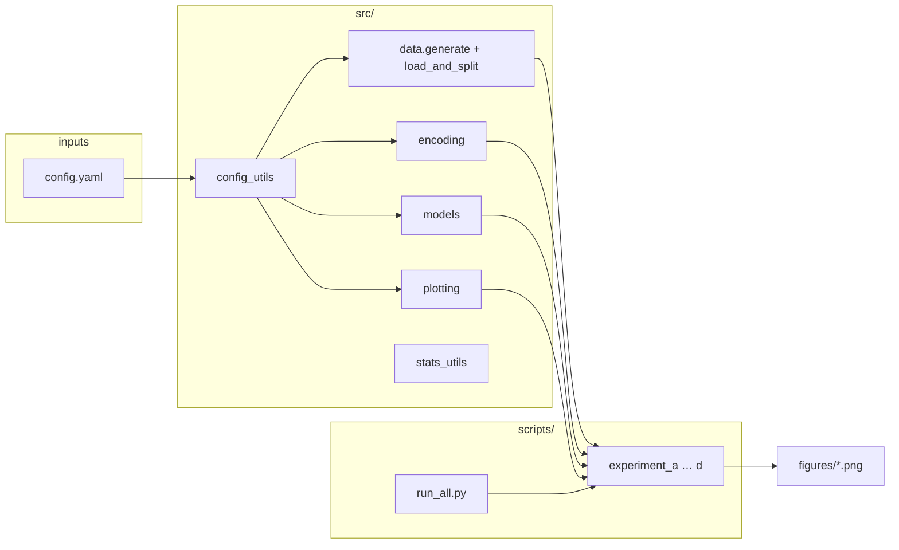

# When a Feature Looks Too Good to Be True

[](LICENSE)
[](LICENSE-TEXT)

**Statistical Foundations of Categorical Feature Engineering for Fraud Detection — from Encoding to Inference**

A **high observed** event rate on a **small** number of rows is often mistaken for a precise population fact—inviting bias and overfitting. High correlation between encoded features is often mistaken for safe redundancy. Both habits confuse **sample** estimates with **population** truths. This article treats category-level rates and encodings as **statistical estimators**, links theory to four reproducible experiments, and ends with explicit **decision checklists** for modelling and production.

## Article (canonical source)

The full write-up is in **[`article/features-that-lie.md`](article/features-that-lie.md)** (Abstract through References, experiments, decision tables). A **Portuguese (pt-BR) translation for review** is in [`article/features-that-lie.pt-BR.md`](article/features-that-lie.pt-BR.md). Supporting material:

- [`article/notation.md`](article/notation.md) — symbol glossary  
- [`article/references.bib`](article/references.bib) — BibTeX  
- [`docs/thesis.md`](docs/thesis.md) — thesis, scope, reader persona  
- [`docs/outline.md`](docs/outline.md) — section map  

The **public HTML** is built and hosted from a **separate portfolio repository** (Markdown → HTML via that repo’s workflow), not from GitHub Pages on this project.

## Architecture (code and docs)



- **`config.yaml`** — seeds, dataset size, copula parameters, encoding \(\alpha,\beta\), XGBoost and figure DPI.  
- **`src/data.py`** — synthetic fraud table (Gaussian copula path by default); stratified split with Uruguay forced into train for the low-support narrative.  
- **`src/encoding.py`** — one-hot, naïve / smoothed / leaky / OOF target encodings.  
- **`src/models.py`** — XGBoost with optional `scale_pos_weight` from class counts.  
- **`src/plotting.py`** — style and `figures/` export.  
- **`src/stats_utils.py`** — Agresti–Coull intervals for Experiment A.  
- **`scripts/run_all.py`** — runs experiments A–D from repo root (sets working directory appropriately).

## What you will find here

- **Theory:** MLE for category-level target rates, variance under low support, Bayesian smoothing (Beta–Binomial), and why correlation does not imply redundancy for predicting \(Y\).  
- **Experiments:** Four reproducible experiments on a synthetic fraud dataset, each tied to a figure and a claim in the article.  
- **Phase 5 helpers:** Pre-publication checklist docs and `scripts/verify_publication_ready.py` (optional `run_all`).

## How to reproduce

```bash
git clone https://github.com/brunoramosmartins/categorical-features-fraud.git
cd categorical-features-fraud

python -m venv .venv
source .venv/bin/activate   # Linux/macOS
# .venv\Scripts\activate    # Windows

pip install -r requirements.txt
python scripts/check_env.py          # optional: quick dependency check
python scripts/run_all.py            # generates figures/ and uses data/ as needed
```

Pre-publication mechanical checks (licences, article presence, figures; can run experiments):

```bash
python scripts/verify_publication_ready.py
python scripts/verify_publication_ready.py --skip-experiments
```

## Development practices

- **Branches and commits:** see [`CONTRIBUTING.md`](CONTRIBUTING.md).  
- **Single source of truth:** article text in `article/`; experiment numbers summarised in [`docs/experiments-summary.md`](docs/experiments-summary.md).  
- **Python:** 3.10+; typed helpers where it clarifies public APIs; module docstrings describe role; functions that cross module boundaries document args/returns.  
- **Changelog:** notable changes in [`CHANGELOG.md`](CHANGELOG.md).

## Project structure

```
categorical-features-fraud/
├── article/          # Full article, references, notation
├── docs/             # Thesis, outline, dataset design, experiment summary, Phase 5 checklists
├── src/              # Data, encoding, models, plotting, stats
├── scripts/          # experiment_a–d, run_all, check_env, verify_publication_ready
├── notebooks/        # Exploratory (not final)
├── figures/          # Generated figures (default 300 dpi)
├── data/             # Generated cache (not tracked)
├── notes/            # Study notes per phase
├── config.yaml
├── requirements.txt
├── CONTRIBUTING.md
└── CHANGELOG.md
```

## License

- **Code** (`src/`, `scripts/`): [MIT License](LICENSE)  
- **Article text** (`article/`): [CC BY 4.0](LICENSE-TEXT)
