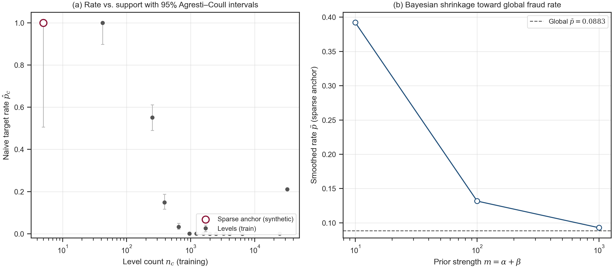
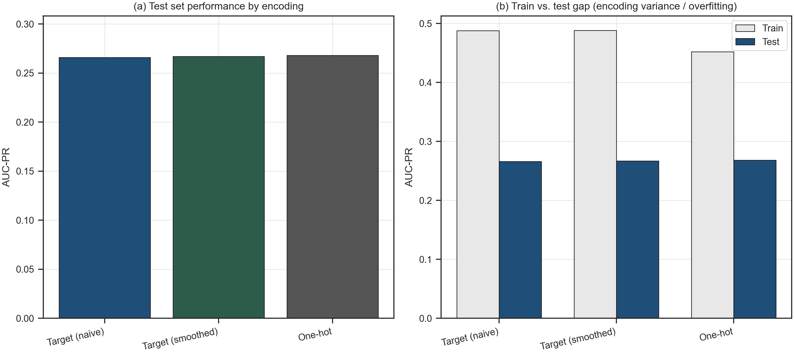
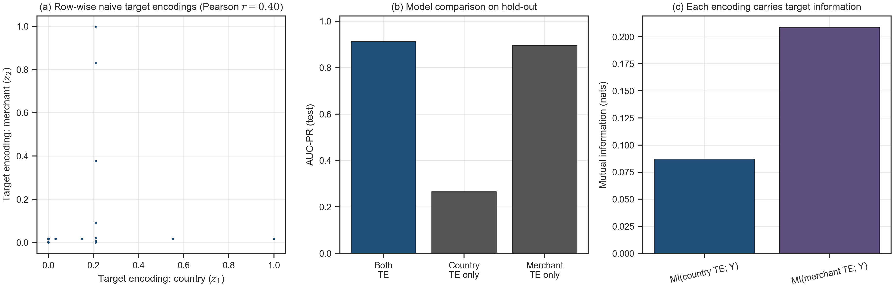
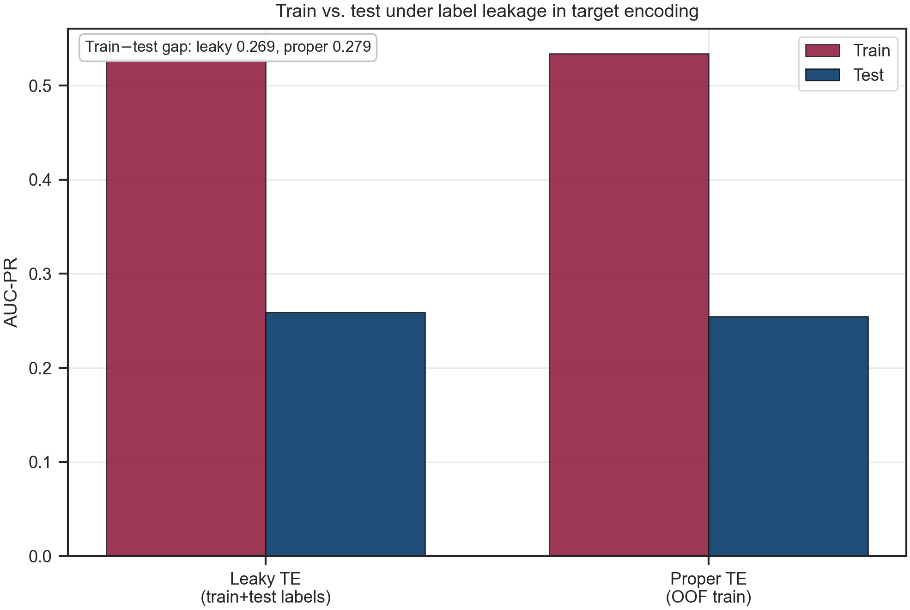

# When a Feature Looks Too Good to Be True

### Statistical Foundations of Categorical Feature Engineering for Fraud Detection — from Encoding to Inference

*Third draft — centres on **EDA practice** (high target ratio in categoricals), **general correlated predictors**, and GitHub-friendly figure paths (`../figures/`).*

---

## Abstract

In a technical case, **exploratory data analysis** is more than listing dtypes and missingness. For **categorical** variables you must look at **how often each level appears** ($n_c$) **and** the **empirical proportion of the positive class** within each level — not treat a raw proportion as a fact. A level with a **high observed rate** on **few** rows is often a **high-variance estimate**, inviting **bias** and **overfitting** if it is fed into a model without intervals, smoothing, or an explicit **fit scope**. Separately, when **any two predictors** (numeric, encoded, or mixed) are **highly correlated**, teams often drop one for “collinearity” without checking **contribution to the target** on hold-out data. This article unifies both issues: **sample statistics are estimators** — precision depends on $n_c$ (or effective sample size) and on whether counts were computed on train, test, or folds (**leakage**). We review MLE and variance for binomial rates, **Agresti–Coull** intervals, **Beta–Binomial** smoothing, encodings by **estimand**, and what to inspect when $|r|$ is large (**VIF** and coefficients for linear models; **permutation importance**, **mutual information**, and **nested models** more broadly). Four reproducible experiments on **synthetic** data illustrate the claims. A short **production checklist** closes the loop.

**Keywords:** exploratory data analysis, categorical features, target encoding, binomial estimation, Bayesian smoothing, multicollinearity, leakage, fraud detection.

---

## 1. Introduction

Most modelling workflows start with **exploratory data analysis**. You open the schema, check types, and profile variables. For **categorical** columns, a natural step is a table of **level frequency** and **target rate per level**. That table is useful — and dangerous if read naïvely. A level that shows **eighty or ninety percent** positives on **twenty** rows is not the same kind of evidence as a level with the same rate on **twenty thousand** rows. The first is dominated by **estimation variance**; the second is much more informative. The mistake is to **only** “treat the data” (encode and train) without **validating** what those proportions mean statistically.

A second gap appears after **bivariate screening**. Correlation matrices — Pearson for roughly linear relationships, Spearman for monotone ones — are computed for **numeric** columns and, after encoding, for **derived** columns too. When two predictors show **strong correlation**, someone may propose dropping one to reduce redundancy. That can be right or catastrophically wrong. **Correlation measures association between predictors**; it does **not** by itself answer whether both columns **help predict** the target, especially in **nonlinear** models or when **interactions** matter.

This article’s stance is statistical: **every summary you plug into a model is an estimator** with a variance and a correct **sample on which it must be fitted**. For a level $c$, the proportion $\hat{p}_c = k_c/n_c$ is an MLE; its sampling variance scales like $1/n_c$. **Smoothing** is the Beta–Binomial posterior mean when that model is the chosen prior [3,4]. **Leakage** is using label information that will not exist at scoring time when building those summaries [6].

**What you can take away.** (1) In EDA, for categoricals with **high target ratio**, always pair the rate with **$n_c$**, add a **binomial interval** (e.g. Agresti–Coull), and consider **smoothing** before trusting a point estimate. (2) When **any** predictors correlate highly, **investigate** with target-aware tools (permutation importance, mutual information, hold-out model comparison) and, for **linear** models, **VIF / regularisation** — do not drop columns on $|r|$ alone. (3) **Target-encoded** categoricals are an important special case: they can correlate strongly yet both remain **informative for $Y$**.

The **synthetic** experiments in this repository exaggerate some effects for plots; **production** data usually shows **high-but-not-perfect** rates under low support — the **same tools** apply.

**Roadmap.** §2: estimator framing and intuition. §3: low support and intervals. §4: Bayesian smoothing and libraries. §5: encodings. §6: **highly correlated predictors** (general + target-encoding special case). §7: **what to do** after seeing high correlations. §8: leakage. §9: experiments. §10: encoding decision framework. §11: conclusion. **Appendix B:** production checklist. **Note:** figure paths use `../figures/` so images render when this file is viewed on GitHub inside `article/`.

---

## 2. A category-level statistic is an estimator

If almost nothing has been observed at level $c$, the empirical rate $\hat{p}_c$ is a **noisy summary**: it can land near $0.9$ or $1$ by chance even when the long-run positive rate is moderate. **Few rows imply high variance** in $\hat{p}_c$. Using that rate as a numeric feature without shrinkage or regularisation injects **high-variance inputs** and encourages **overfitting** on rare levels.

Formally, let $X$ be categorical and $c$ a fixed level. Among $n_c$ training rows with $X=c$, let $k_c$ be the count with $Y=1$. The **sample proportion**

$$
\hat{p}_c = \frac{k_c}{n_c}
$$

is the **maximum likelihood estimator** (MLE) of $p_c = P(Y=1 \mid X=c)$ under a binomial model [7]. Its sampling variance (given $n_c$) is

$$
\mathrm{Var}(\hat{p}_c) = \frac{p_c(1-p_c)}{n_c}.
$$

**Low support** means small $n_c$, hence large variance: $\hat{p}_c$ is a **high-variance estimator**. The **observed** rate can look extreme even when $p_c$ is not.

**Plug-in variance** uses $\hat{p}_c(1-\hat{p}_c)/n_c$; when $\hat{p}_c$ equals $0$ or $1$ this is **zero**, falsely suggesting certainty. **Wilson**, **Agresti–Coull**, and **Clopper–Pearson** intervals stay wide in that regime [1,2].

**Consequence.** Target encoding that maps $c$ to $\hat{p}_c$ does not stamp a “true risk” on the level; it passes an **estimate** whose reliability is governed by $n_c$.

**Asymptotics.** For large $n_c$, the MLE is approximately normal. Fraud data often has a **long tail** of sparse levels — where shortcuts fail. **Never treat $\hat{p}_c$ as equal to $p_c$** when $n_c$ is small.

---

## 3. The low-support problem: a numerical deconstruction

During EDA you might see $(k_c, n_c) = (5,5)$ so $\hat{p}_c=1$, or $(7,10)$ so $\hat{p}_c=0.7$. **Production** more often looks like the second pattern than a literal 100% on five rows; synthetic examples sometimes use the boundary case because it **dramatises** plug-in failure — the **logic** is the same for any **high** $\hat{p}_c$ with **small** $n_c$.

The Agresti–Coull adjusted proportion uses

$$
\tilde{p} = \frac{k+2}{n+4}, \qquad \tilde{n} = n+4.
$$

For $(k,n)=(5,5)$, $\tilde{p}=7/9\approx 0.78$. A nominal 95% interval is $\tilde{p} \pm z_{0.975}\sqrt{\tilde{p}(1-\tilde{p})/\tilde{n}}$, often spanning roughly **0.5** to **1** after clipping [1]. For $(k,n)=(7,10)$, the interval is still **wide** compared with a level with thousands of rows.

Contrast a **high-$n_c$** level (e.g. $n_c\sim 10^{4}$, $\hat{p}_c$ near the global base rate): the same machinery gives a **narrow** band. The question “what is $p_c$?” has different **precision** by level.

| Profile | $n_c$ (illustrative) | $k_c$ | $\hat{p}_c$ | 95% AC interval (order of magnitude) |
|---------|------------------------|---------|----------------|----------------------------------------|
| Sparse, extreme | $\approx 5$ | $\approx 5$ | $1.0$ | Very wide |
| Sparse, high | $10$ | $7$ | $0.7$ | Still wide |
| Well supported | $\approx 10^{4}$ | $\approx 0.004\,n_c$ | $\approx 0.004$ | Narrow |

**Practical rule of thumb.** Always report **$n_c$** next to each level’s target rate in EDA outputs. Below a few dozen rows (threshold tuned with **domain** and **hold-out performance**), treat rates as **low-support**: show **intervals**, apply **smoothing**, or pool levels before declaring a “strong signal.”

---

## 4. Bayesian smoothing: the principled fix

Prior $p_c \sim \mathrm{Beta}(\alpha,\beta)$, likelihood $k_c \mid p_c \sim \mathrm{Binomial}(n_c, p_c)$. Posterior

$$
p_c \mid k_c, n_c \sim \mathrm{Beta}(\alpha + k_c,\; \beta + n_c - k_c),
$$

with mean

$$
\tilde{p}_c^{\mathrm{Bayes}} = \frac{\alpha + k_c}{\alpha + \beta + n_c}
= w_c\,\hat{p}_c + (1-w_c)\,\mu_0,
\qquad
w_c = \frac{n_c}{n_c + \alpha + \beta}.
$$

Small $n_c$ pulls the estimate toward the prior mean $\mu_0$ (often the global training rate $\bar{p}$); large $n_c$ recovers the MLE [3,4].

**Libraries.** `category_encoders` smoothing parameters map naturally to **prior strength** [5]. **scikit-learn** `TargetEncoder` (1.2+) uses **cross-fitted** statistics — aligned with correct **fit scope**, even outside a literal Beta–Binomial story.

**Pseudocode (smoothed map, train → apply).**

```text
global_mean ← mean(y_train)
for each level c in X_train:
    (k_c, n_c) ← counts for level c on training
    map[c] ← (alpha + k_c) / (alpha + beta + n_c)
for each row i in X_apply:
    encoded[i] ← map[x_i] if x_i in map else global_mean
```

Tune $m=\alpha+\beta$ by cross-validation or domain rules [3,4]. At scoring, rare levels still use **training** counts unless you adopt a documented rolling policy.

---

## 5. The encoding landscape: what does each map estimate?

| Encoding | Formula (level $c$) | Estimates | Uses $Y$? | Leakage risk | High cardinality |
|----------|---------------------|-----------|-----------|--------------|------------------|
| One-hot | $\mathbb{1}[X=c]$ | Membership in $c$ | No | None | Poor (sparse) |
| Frequency | $n_c/N$ | $\hat{P}(X=c)$ | No | None | Good |
| Target (naïve) | $k_c/n_c$ | $P(Y=1 \mid X=c)$ MLE | Yes | **High** if misfit | Good |
| Smoothed target | $(k_c+\alpha)/(n_c+\alpha+\beta)$ | Posterior mean | Yes | Lower; still scope errors | Good |

**When to use (compact).** One-hot for low $C$ and linear models. Frequency when **rarity** of $X$ matters. Naïve target mainly as a **baseline** — production pipelines should prefer **OOF/CV** or smoothed variants. Tree libraries with **native** categoricals may skip hand-built encodings; target columns can still add a scalar signal — **validate** on hold-out [7]. **Embeddings** are out of scope; label-trained embeddings need the same **scope** discipline.

---

## 6. Highly correlated predictors: what to investigate

High **pairwise** correlation (Pearson or Spearman) is a **screening** finding, not a deletion rule. It applies to **numeric** features, **binary** flags, **target-encoded** categoricals, and combinations thereof.

**What correlation does not tell you.** It does not say whether removing one column **improves or harms** prediction of $Y$ on **held-out** data. Two predictors can move together and still carry **non-overlapping** information for the target (different **partial** relationships, **interactions**, or **nonlinear** effects invisible to Pearson).

**What to look at next (general toolkit).**

1. **Target linkage.** **Mutual information** with $Y$, **permutation importance** on a validated model, or **compare validation scores** with and without each column (nested or ablation).
2. **Linear models.** If you fit **linear** or **logistic** regression, check **variance inflation (VIF)** and coefficient stability; **ridge/elastic net** often handle redundancy better than arbitrary dropping.
3. **Nonlinear models** (trees, GBDT). Importance and **hold-out AUC-PR / log-loss** matter more than $|r|$ between features; inspect **partial dependence** or SHAP **with awareness of correlation** (interpretation gets harder when features are redundant).
4. **Partial correlation** / controlling for known confounders when the **data-generating** story suggests a common cause.

**Special case: target-encoded categoricals.** Pearson correlation between two **target-encoded** columns measures linear association between **row-wise** level rates. It still does **not** imply **conditional redundancy** for $Y$. The small table below is the clean counterexample.

| Row | $X_1$ | $X_2$ | $Y$ |
|-----|-------|-------|-----|
| 1 | C | M | 0 |
| 2 | A | P | 1 |
| 3 | C | M | 0 |
| 4 | B | P | 1 |
| 5 | B | M | 0 |
| 6 | B | M | 1 |
| 7 | B | P | 0 |
| 8 | C | N | 0 |

Naïve training encodings give $\mathrm{Corr}(z_1,z_2)\approx 0.72$, yet $P(Y=1 \mid X_1=A)=1$ while $P(Y=1 \mid X_2=M)=1/4$, and a model using **both** can beat either alone.

**Bottom line.** Treat **high $|r|$** as a prompt to run **target-aware** diagnostics and **model comparisons**, not as permission to delete a feature.

---

## 7. After you see high correlations: a practical sequence

When a correlation matrix (or a pairplot) flags **strong** association between predictors $A$ and $B$, a productive order of work is:

1. **Note** the pair and the coefficient (Pearson vs Spearman, depending on shape).
2. **Score each predictor against $Y$** on **validation** data: mutual information, permutation importance, or change in validation metric when each is removed **while the other stays**.
3. If **both** materially help the model, **keep both** unless a simpler model is a product requirement — document the evidence.
4. If one is **inert** on validation when the other is present, the **inert** one is the better candidate to drop — again document metrics.
5. **Record** the decision (numbers, not “we removed collinear features”).

For **target-derived** columns, step 2 is **mandatory** before any drop [7].

---

## 8. Target leakage: when the estimator sees the answer

**Leakage** here means a feature uses **that row’s label** (or out-of-time information) in a way **impossible** at scoring.

**Tiny example.** Three rows share level $c$ with labels $(1,0,0)$. A **naïve** target rate for $c$ computed **including** each row makes the feature a **proxy for $Y$**. Training metrics inflate; **test** performance tells the truth. **Fix:** **out-of-fold** counts, leave-one-out, or **strictly training-only** aggregates [6].

**Model impact.** Inflated **training** AUC-PR / accuracy, misleading **importance**, and **poor deployment** behaviour. **Low $n_c$** amplifies how much one label moves $\hat{p}_c$.

**Smoke test.** Training jumps while validation stalls after adding target features → audit **where** $k_c$ and $n_c$ were computed.

---

## 9. Experiments

**Reproducibility** (repository **root**):

```text
python -m venv .venv && source .venv/bin/activate   # or Windows: .venv\Scripts\activate
pip install -r requirements.txt
python scripts/run_all.py
```

Figures are saved under `figures/` (DPI in `config.yaml`). See `docs/dataset-design.md` and `docs/experiments-summary.md`.

**Viewing figures on GitHub.** Links below use **`../figures/`** so they resolve when browsing `article/features-that-lie.md` in the GitHub UI.

| Experiment | Insight | Figure path (from this folder) |
|------------|---------|--------------------------------|
| A | Wide intervals for tiny $n_c$; smoothing shrinks sparse levels toward $\bar{p}$ | `../figures/exp_a_perfect_feature.png` |
| B | Naïve target often larger train–test gap than smoothed | `../figures/exp_b_smoothing_effect.png` |
| C | Naïve TE columns can correlate moderately after pooling yet both stay informative; hold-out favours the joint model here | `../figures/exp_c_correlation_trap.png` |
| D | Leaky label pooling inflates **training** AUC-PR | `../figures/exp_d_encoding_comparison.png` |

*If images do not inline in your viewer, open the paths above or the files under `figures/` at repo root.*

### Experiment A

**Setup.** Stratified split; in code, a **synthetic sparse level** (all its rows kept in training) has $n_c=5$, $k_c=5$. Agresti–Coull intervals on train; second panel varies prior strength $m=\alpha+\beta$.

**Figure 1.** 

**Observation.** Interval stays wide at $\hat{p}_c=1$; larger $m$ shrinks toward $\bar{p}$. **Links:** §§2–4.

### Experiment B

**Setup.** XGBoost with numerics plus **country** as naïve target, smoothed target, or one-hot.

**Figure 2.** 

**Observation.** Naïve target often shows a larger train–test gap. **Links:** §§4–5.

### Experiment C

**Setup.** Naïve target encoding for `country` and `merchant_category` on **training only**; Pearson $r$ on row-wise encodings; mutual information with $Y$; XGBoost with numerics plus both TEs vs one TE dropped.

**Figure 3.** 

**Observation.** Panel (a) shows how pooling into many levels dampens linear correlation versus latent $(z_1,z_2)$; panels (b)–(c) still support checking **validation** metrics and target linkage before dropping either column. **Links:** §§6–7.

### Experiment D

**Setup.** **Leaky:** TE with train+test labels pooled. **Proper:** OOF on train; test from train-only stats (`scripts/experiment_d_encoding_comparison.py`).

**Figure 4.** 

**Observation.** Training AUC-PR can be optimistic under leakage. **Links:** §8; [6].

---

## 10. A framework for encoding decisions

Work along **cardinality**, **support** ($n_c$), and **model family**.

1. Flag **small** $n_c$ in EDA; prefer intervals, smoothing, or pooling before trusting raw $\hat{p}_c$.
2. Pick encoding using §5.
3. For **target-based** maps, fix **fit scope** (train-only, OOF, CV) **before** tuning.
4. After correlation screens, follow **§7** before dropping columns.
5. Validate on **hold-out**; monitor train–validation gap.

**Compass table** (validate every row on your data):

| Cardinality | Support | Model | First-line encoding | Target-map scope |
|-------------|---------|-------|---------------------|------------------|
| Low | High per level | Logistic | One-hot or smoothed target | Train + CV |
| High | Heavy tail | GBDT (native cat) | Native ± smoothed target | OOF / train-only |
| High | Heavy tail | Neural net | Embedding or frequency + numeric | No label leakage |
| Any | Any | Any | High $|r|$ | §7 before dropping |

---

## 11. Conclusion

**EDA** for categoricals should always combine **counts**, **target rates**, and **uncertainty** (intervals, smoothing). **High correlation** between predictors should trigger **target-aware** and **model-based** checks, not automatic deletion. **Target-encoded** levels are one important instance where $|r|$ can mislead.

**Summary**

- $\hat{p}_c$ has variance $\sim 1/n_c$; plug-in variance fails at $0$ and $1$.
- Agresti–Coull (and related) intervals quantify uncertainty for **sparse** levels.
- Beta–Binomial smoothing is a transparent shrinkage tool with library analogues.
- Encodings differ by **estimand**; choose deliberately.
- **Correlation $\not\Rightarrow$ redundant for $Y$**; use validation **ablation** and importance.
- **Leakage** breaks generalisation; audit **fit scope**.

Quantitative plots depend on `src/data.py` and `config.yaml`; the **workflow** claims do not.

**Closing line.** **Profile categoricals with $n_c$ and intervals, treat correlation as a prompt for target-aware model checks, and ship encodings only after you know the sample each number came from.**

---

## Appendix A: Repository file map

| Topic | Location |
|-------|----------|
| Fig. 1 | `scripts/experiment_a_perfect_feature.py`, `src/stats_utils.py` |
| Fig. 2 | `scripts/experiment_b_smoothing_effect.py`, `src/encoding.py`, `src/models.py` |
| Fig. 3 | `scripts/experiment_c_correlation_trap.py` |
| Fig. 4 | `scripts/experiment_d_encoding_comparison.py` |
| Data | `src/data.py`, `docs/dataset-design.md` |
| Metrics summary | `docs/experiments-summary.md` |
| Notation | `article/notation.md` |
| BibTeX | `article/references.bib` |

`python scripts/run_all.py` from the **repository root** regenerates all figures.

---

## Appendix B: Production-oriented checklist

- [ ] EDA tables include **$n_c$** and **intervals** (or smoothed rates) for sparse levels.
- [ ] Low-support thresholds documented; **Other** / pooling rules defined.
- [ ] No **naïve** target stats fitted using validation/test labels.
- [ ] **OOF/CV** or train-only target encodings; policy in model card.
- [ ] High $|r|$ pairs go through **§7** before drops.
- [ ] Validation metrics with/without suspect columns logged.
- [ ] Encoding refresh / drift plan for changing $n_c$ and rates.

---

## Viewing this article on GitHub

- **Images** use relative paths `../figures/*.png` from this folder so the GitHub file viewer resolves them.
- **Equations:** GitHub renders [LaTeX in Markdown](https://docs.github.com/en/get-started/writing-on-github/working-with-advanced-formatting/writing-mathematical-expressions) using `$...$` and `$$...$$`. Prefer single-character subscripts without extra braces (`$n_c$`, `$\hat{p}_c$`) where possible; avoid heavy `\{...\}` in short inline math when plain text is clearer.
- For **print-quality** math and layout, build **HTML** in your portfolio pipeline (MathJax).

---

## References

[1] Agresti, A., & Coull, B. A. (1998). Approximate is better than “exact” for interval estimation of binomial proportions. *The American Statistician*, 52(2), 119–126.

[2] Brown, L. D., Cai, T. T., & DasGupta, A. (2001). Interval estimation for a binomial proportion. *Statistical Science*, 16(2), 101–133.

[3] Bishop, C. M. (2006). *Pattern Recognition and Machine Learning*. Springer.

[4] Murphy, K. P. (2012). *Machine Learning: A Probabilistic Perspective*. MIT Press.

[5] Micci-Barreca, D. (2001). A preprocessing scheme for high-cardinality categorical attributes. *ACM SIGKDD Explorations*, 3(1), 27–32.

[6] Kaufman, S., Rosset, S., Perlich, C., & Stitelman, O. (2012). Leakage in data mining. *ACM TKDD*, 6(4), 1–21.

[7] Hastie, T., Tibshirani, R., & Friedman, J. (2009). *The Elements of Statistical Learning* (2nd ed.). Springer.

*BibTeX keys:* `agresti1998approximate`, `brown2001interval`, `bishop2006pattern`, `murphy2012machine`, `micci2001preprocessing`, `kaufman2012leakage`, `hastie2009elements` — see `article/references.bib`.
